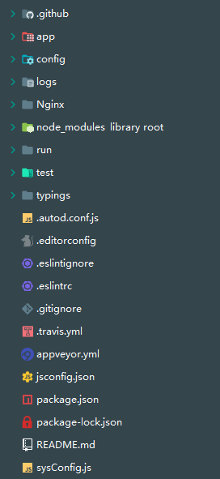
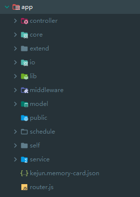
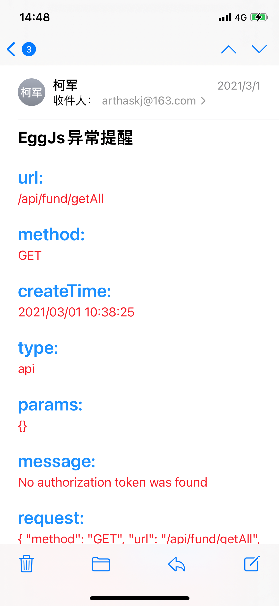

## Egg实现接口服务

> 之前使用Express写过一个[接口服务](src/md/node/express)，因为基本上很多流程都需要自己实现，用起来很是麻烦，了解到Eggjs之后打算用Eggjs重写一个接口服务，果然是折腾不死。

### 一、目录结构





### 二、路由处理、Config配置

```js
'use strict';

const prefix = '/api';

const routerData = {
  user: [
    { key: 'getAll' },
    { key: 'getById' },
    { key: 'deleteById' },
    { key: 'add', type: 'post' },
    { key: 'update', type: 'post' },
    { key: 'signUp', type: 'get', disJwt: true },
    { key: 'login', type: 'get', disJwt: true },
  ],
  todo: [
    { key: 'getAll' },
    { key: 'getById' },
    { key: 'deleteById' },
    { key: 'add', type: 'post' },
    { key: 'update', type: 'post' },
    { key: 'changeStatus' },
  ],
};

/**
 * @param {Egg.Application} app - egg application
 */
module.exports = app => {
  const { router, controller, jwt } = app;
  router.get('/api/home/index', controller.home.index);

  // 微信开发相关
  router.get('/api/WeChatController/GetWeApi', controller.wechat.GetWeApi);
  router.all('/api/WeChatController/CheckWeChatServer', controller.wechat.CheckWeChatServer);
  // router.get('/api/WeChatController/wechat', controller.wechat.wechat);

  Object.keys(routerData).forEach(key => {
    const items = routerData[key];
    items.forEach(item => {
      const { type, key: keyName, disJwt } = item;
      // 判断是否需要jwt验证
      if (disJwt) {
        router[type || 'get'](`${prefix}/${key}/${keyName}`, controller[key][keyName]);
      } else {
        router[type || 'get'](`${prefix}/${key}/${keyName}`, jwt, controller[key][keyName]);
      }
    });
  });

  // app.io.of('/')
  // app.io.route('chat', app.io.controller.chat.index);

  // app.io.of('/chat')
  app.io.of('/io/common').route('chat', app.io.controller.chat.index);
  app.io.of('/io/common').route('demo', app.io.controller.chat.demo);

};

```


```js
// config.default.js 

'use strict';
const cConfig = require('../sysConfig');

/**
 * @param {Egg.EggAppInfo} appInfo app info
 */
module.exports = appInfo => {
  /**
   * built-in config
   * @type {Egg.EggAppConfig}
   **/
  const config = exports = {
    security: {
      csrf: {
        enable: false,
      },
    },
  };

  // use for cookie sign key, should change to your own and keep security
  config.keys = appInfo.name + '***';

  // 添加中间件
  config.middleware = [
    'paramsFormat',
    'errorHandler',
  ];

  config.errorHandler = {
    // 通用配置（以下是重点）
    enable: true, // 控制中间件是否开启。
    // match:'/user/list', // 设置只有符合某些规则的请求才会经过这个中间件（匹配路由）
    // ignore:'/shop' // 设置符合某些规则的请求不经过这个中间件。
    /**
     注意：
     1. match 和 ignore 不允许同时配置
     **/
    // match 和 ignore 支持多种类型的配置方式：字符串、正则、函数（推荐）
    // match(ctx) {
    //     // 只有 ios 设备才开启
    //     const reg = /iphone|ipad|ipod/i;
    //     return reg.test(ctx.get('user-agent'));
    // },
  };

  // add your user config here
  const userConfig = {
    // myAppName: 'egg',
  };

    // mongodb 连接
  const mongoose = {
    client: {
      url: 'mongodb://***:***@***/db_dev', // 你的数据库地址，不要端口
      options: {
        useNewUrlParser: true,
        useUnifiedTopology: true,
      },
    },
  };

    // socket连接配置
  const io = {
    init: { }, // passed to engine.io
    namespace: {
      // '/': {
      //   connectionMiddleware: [ 'auth' ],
      //   packetMiddleware: [ 'filter' ],
      // },
      '/io/common': {
        connectionMiddleware: [ 'auth' ],
        packetMiddleware: [ 'filter' ],
      },
    },
  };

    // jwt验证配置
  config.jwt = {
    secret: '***',
  };

    // 微信相关配置
  config.wechat = {
    token: cConfig.wechat.token,
    appid: cConfig.wechat.appId,
    encodingAESKey: cConfig.wechat.encodingAESKey,
  };

  return {
    ...config,
    ...userConfig,
    mongoose,
    io,
  };
};

```


### 三、Controller

> Controller层写了一个基类，基类里进行了参数处理以及返回体处理，使用起来就不用关心请求方式和返回体了。

```js
const { Controller } = require('egg');
class BaseController extends Controller {
  get user() {
    return this.ctx.session.user;
  }

  success(data) {
    this.ctx.body = {
      success: true,
      message: '',
      data,
    };
  }

  error() {
    this.ctx.body = {
      success: false,
      message: '系统级别错误！',
      data: null,
    };
  }

  responseFormat(response) {
    if (response || response === false || response === 0) {
      this.success(response);
    } else {
      this.error();
    }
  }

  notFound(msg) {
    msg = msg || 'not found';
    this.ctx.throw(404, msg);
  }
}
module.exports = BaseController;

```

```js
'use strict';

const BaseController = require('../core/baseController');

class TodoController extends BaseController {

  async add() {
    this.responseFormat(await this.service.todo.add(this.ctx.KParams));
  }

  async update() {
    this.responseFormat(await this.service.todo.update(this.ctx.KParams));
  }

  async getAll() {
    this.responseFormat(await this.service.todo.getAll());
  }

  async getById() {
    this.responseFormat(await this.service.todo.getById(this.ctx.KParams));
  }

  async deleteById() {
    this.responseFormat(await this.service.todo.deleteById(this.ctx.KParams));
  }

  async changeStatus() {
    const { _id, completed } = this.ctx.KParams;
    this.responseFormat(await this.service.todo.changeStatus(_id, completed));
  }
}

module.exports = TodoController;

```

### 四、Service

```js
const { Service } = require('egg');

class TodoService extends Service {
  async getAll() {
    const { userId } = this.ctx.KParams;
    return await this.ctx.model.Todo.find({ userId }).sort([[ '_id', -1 ]]);
  }

  async add(params) {
    if (params) {
      params.createTime = this.ctx.helper.dateFormat(new Date(), 'YYYY/mm/dd HH:MM:SS');
      const { content } = params;
      if (content.length > 60) {
        this.ctx.throw(500, '请保证文本在60字以内！');
      }
      return this.ctx.model.Todo.create(params);
    }
    this.ctx.throw(500, '请输入参数！');
  }

  async getById(params) {
    const { _id } = params;
    if (_id) {
      return this.ctx.model.Todo.findById(_id);
    }
    this.ctx.throw(500, '缺少ID！');
  }

  async deleteById(params) {
    const { _id } = params;
    if (_id) {
      return await this.ctx.model.Todo.deleteOne({ _id });
    }
    this.ctx.throw(500, '缺少ID！');
  }

  async update(params) {
    const { _id } = params;
    if (_id) {
      return await this.ctx.model.Todo.updateOne({ _id }, params);
    }
    this.ctx.throw(500, '缺少ID！');
  }

  async changeStatus(_id, completed) {
    if (_id) {
      return await this.ctx.model.Todo.updateOne({ _id }, { completed });
    }
    this.ctx.throw(500, '缺少ID！');
  }

}

module.exports = TodoService;

```

### 五、Model

> mongodb使用前配置model会更方便

```js
'use strict';

module.exports = app => {
  const mongoose = app.mongoose;
  const Schema = mongoose.Schema;
  // 下面得操作是连接数据库
  const TodoSchema = new Schema({
    // 修改和新增用到，规定字段得类型和其他条件等
    // _id: {
    //   type: Schema.ObjectId,
    //   default: mongoose.Types.ObjectId(),
    //   required: true,
    // },
    id: {
      type: String,
    },
    userId: {
      type: String,
      required: true,
    },
    userName: {
      type: String,
      required: true,
    },
    completed: {
      type: Boolean,
      default: false,
    },
    content: {
      type: String,
      required: true,
    },
    createTime: {
      type: String,
      required: true,
    },
  }, { versionKey: false });

  return mongoose.model('Todo', TodoSchema, 'todo');
};

```

### 六、中间件处理

> 由于Get和Post请求放置的参数位置不一致，这里为了偷懒用中间件在收到请求时将他们的参数都存在一个公共的字段上，这样后期就不需要再判断了

```js
module.exports = () => {
  return async function paramsFormat(ctx, next) {
    const { request } = ctx;
    const { method } = request;
    if (method === 'GET') {
      ctx.KParams = ctx.query || {};
    } else if (method === 'POST') {
      ctx.KParams = request.body || {};
    }
    ctx.KParams.userId = request.header.userid;
    await next();
  };
};
```

> 通过中间件统一处理异常，并在发生异常时发送邮件通知我

```js
const sendMail = require('../lib/mail');

const formatErrorMsg = ctx => {
  const { request, body } = ctx;
  const { method, url } = request;
  const params = method === 'GET' ? ctx.query : request.body;
  const createTime = ctx.helper.dateFormat(new Date(), 'YYYY/mm/dd HH:MM:SS');
  const res = {
    url, method, createTime,
    type: 'api',
    params: JSON.stringify(params),
    message: body.message,
    request: JSON.stringify(request, null, 2),
  };
  let tpl = '';

  // 组装错误信息模版
  Object.keys(res).forEach(key => {
    tpl = tpl + `<div style="margin-bottom: 20px">
                  <span style="font-size: 24px;font-weight: bold;color:#1890ff;">${key}:</span>
                  <br/>
                  <span style="color:#f5222d;">${res[key]}</span>
                </div>`;
  });

  // 记录到数据库中，方便进行错误分析
  ctx.model.Error.create(res);
  return tpl;
};

module.exports = (option, app) => {
  return async function errorHandler(ctx, next) {
    try {
      await next();
    } catch (err) {
      // 所有的异常都在 app 上触发一个 error 事件，框架会记录一条错误日志
      ctx.app.emit('error', err, ctx);

      const status = err.status || 500;
      // 生产环境时 500 错误的详细错误内容不返回给客户端，因为可能包含敏感信息
      const message = status === 500 && ctx.app.config.env === 'prod'
        ? 'Internal Server Error'
        : err.message;
      // 从 error 对象上读出各个属性，设置到响应中
      ctx.body = {
        success: false,
        message,
      };
      if (status === 422) {
        ctx.body.detail = err.errors;
      }
      ctx.status = status;
      if (app.config.env === 'prod') {
        await sendMail([ 'arthaskj@163.com' ], 'EggJs异常提醒', formatErrorMsg(ctx));
      }
    }
  };
};

```

