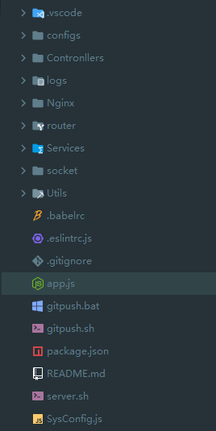

## 使用Node实现接口服务

> 如果一个前端只会前端你会发现能做的东西很有限，没办法与网络交互，所以会后端语言很重要。在挑选过java、c#、php以及python之后，发现还是咱们的js更香。因此，如果我们的需求只是实现简单的接口，那么node js会是很好的选择。
>
> 因为之前写过C#的代码，所以风格上也很像C#风格。至于为什么不直接用C#来写，原因就是虽然现在.net core可以在linux上部署，但是实在是太麻烦了。。。具体请[移步](src/study/dotnetCore)


### 一、目录结构



### 二、App.js文件

```js
/* eslint-disable no-extend-native */
/*
 * @Author: Ke Jun
 * @Date: 2018-12-21 09:00:36
 * @LastEditTime: 2019-08-20 17:41:10
 * @Description: 项目启动文件
 */
let express = require('express');
let bodyParser = require('body-parser');
let app = express();
let https = require('https');
let fs = require('fs');
const log4js = require('./Utils/log4js') // 日志文件
const socket = require('./socket/socket')
const config = require('./SysConfig');
const {httpsPort, httpPort} = config

let cors = require('cors');

app.use(cors());
app.use(log4js);// 日志中间件      2019/12/02 19:02:38      --柯军

// 设置跨域访问
app.all('*', function(req, res, next) {
  res.header('Access-Control-Allow-Origin', '*'); // 这个表示任意域名都可以访问，这样写不能携带cookie了。
  res.header('Access-Control-Allow-Headers', 'X-Requested-With');
  res.header('Access-Control-Allow-Methods', 'PUT,POST,GET,DELETE,OPTIONS'); // 设置方法
  res.header('X-Powered-By', ' 3.2.1');
  res.header('Content-Type', 'application/json;charset=utf-8');
  next();
  // if (req.method == 'OPTIONS') {
  //   res.send(200); // 意思是，在正常的请求之前，会发送一个验证，是否可以请求。
  // }
  // else {
  //   next();
  // }
});

// post方法必须要这段
app.use(bodyParser.urlencoded({
  extended: false
}));

app.use('/api/', require('./router/index.js'));

// post用req.body获取数据
// get用req.query获取数据

// 配置服务端口
// 1、创建https服务器
// 这里放置自己得相关https用到得ssl证书
let privateKey = fs.readFileSync('./Nginx/2_arthaskj.cn.key', 'utf8');
let certificate = fs.readFileSync('./Nginx/1_arthaskj.cn_bundle.crt', 'utf8');
let credentials = {
  key: privateKey,
  cert: certificate
};
let httpsServer = https.createServer(credentials, app);
httpsServer.listen(httpsPort);

let server = app.listen(httpPort || 3000, function() {
  let host = server.address().address;
  let port = server.address().port;
  console.log('Example app listening at http://%s:%s', host, port);
});

// 启动socket
socket.socketStart();
```

### 三、系统配置文件SystemConfig.js

```js
/**
 * @Author: 柯军
 * @Date: 2019/09/11 18:49:44
 * @Description: 系统配置项目
 */
module.exports = {
  httpsPort: 4380, // 自定义数字端口，给https用的端口
  httpPort: 3000, // 自定义数字端口，给http用的端口
  socketPort: 8080, // socket端口

  // email发送方配置
  email: {
    service: 'QQ',
    user: '***',
    password: '***', // 授权码，不是邮箱密码
  },

  // 数据库配置
  mysql: {
    pysp: {
      host: '***',
      user: '***',
      password: '***',
      database: '***',
      port: '***'
    },
    project: {
      host: '***',
      user: '***',
      password: '***',
      database: '***',
      port: '3306'
    }
  },

  // 微信公众号配置
  wechat: {
    appId: '***',
    appSecret: '***',
    token: '***',
    encodingAESKey: '***'
  },

  // 微信小程序配置
  wechatP: {
    appId: '***',
    secret: '***',
    grant_type: 'authorization_code'
  },

  // redis配置
  redis: {
    port: 6379,
    path: '127.0.0.1'
  },

  // mongodb配置
  mongodb: {
    port: '27017',
    path: '***'
  }
}
```

### 四、路由处理

```js
/*
 * @Author: 柯军
 * @Date: 2019-08-20 10:48:49
 * @Description: 接口路由中转
 */

const express = require('express');
const MongoDb = require('../Utils/lib/mongodb')

const router = express.Router();
module.exports = router;

// 第一次请求后将类保存到map中，下次直接从map中拿接口数据      2019/10/12 16:20:10      --柯军
const ContronllersMap = new Map();


// TODO: 这里没有区分是post还是get请求方式，也就是说同一个请求两种方式都可以，将来试着使用ts解释器实现区分      2019/10/23 08:58:20      --柯军
// 抓取所有请求并进行分析路由      2019/08/20 19:59:50      --柯军
router.all('*', async(request, response) => {
  let url = request._parsedUrl.pathname;
  if (url !== '/favicon.ico') { // favicon.ico是页面title左侧的网站图标，会默认请求，因此清除第二次访问
    let urlArr = url.split('/'),
      ContronllerName = urlArr[1],
      actionName = urlArr[2],
      method = request.method;

    /**
     * @createtime 2019/08/20 17:37:42
     * @author 柯军 <arthaskj@163.com>
     * @param {string}
     * @desc 根据请求类型获取前端传递的参数
     */
    let setParams = (method, request) => {
      let val = null;
      // 根据GET或者POST来获取传输给后台的参数
      switch (method) {
        case 'GET':
          val = request.query;
          break;
        case 'POST':
          val = request.body;
          break;
        default:
          val = request.query;
          break;
      }
      return val;
    };

    // 根据路由去寻找Service，找不到或者出错就抛出异常      2019/08/20 19:59:25      --柯军
    try {
      let params = setParams(method, request),
        Contronller = null,
        contronllerClass = null;
      if (ContronllersMap.has(ContronllerName)) {
        contronllerClass = ContronllersMap.get(ContronllerName);
      } else {
        contronllerClass = require(`../Contronllers/${ContronllerName}`);
        if (contronllerClass) ContronllersMap.set(ContronllerName, contronllerClass);
      }

      Contronller = new contronllerClass({request, response});
      let result = await Contronller[actionName](params);
      if (result === undefined) {
        console.log('没有返回数据');
        return ;
      }
      response.status(200);
      // 为了通过微信公众号验证所作更改      2019/10/15 17:33:32      --柯军
      // response.json(result);
      response.send(result || {success: true, message: '请求成功', data: result});
    } catch (error) {
      // 请求抛出错误并停止      2019/10/12 16:19:42      --柯军
      response.status(400);
      response.json(error.toString());
      throw new Error(error.toString()); // 抛出异常
    }
  }
})
```

### 五、Contronller层

> BaseContronller

```js
/*
 * @Author: 柯军
 * @Date: 2019-08-20 10:38:17
 * @Description:
 */

module.exports = class BaseContronller {

  constructor(props) {
    this.request = props.request;
    this.response = props.response;
    this.requestParams = {request: props.request, response: props.response};
    this.requestDto = {request: this.request, response: this.response};
    props.response.status(200);
  }


}
```

> Demo

```js
/*
 * @Author: 柯军
 * @Date: 2019-08-20 17:42:49
 * @Description: 待办事项控制器
 */
const BaseContronller = require("../Utils/BaseContronller");
const ToDoListSvc = require("../Services/ToDoListSvc");

module.exports = class ToDoListContronller extends BaseContronller {

  constructor(props) {
    super(props);
    this.svc = new ToDoListSvc();
  }

  // 根据用户获取所有待做项
  GetTodoList(params) {
    return this.svc.GetTodoList(params);
  }

  // 保存待办事项
  SaveTodoList(params) {
    return this.svc.SaveTodoList(params);
  }

  // 批量设置待做状态
  SetTodosStatus(params) {
    return this.svc.SetTodosStatus(params);
  }

  // 单个设置待做状态
  SetTodoStatus(params) {
    return this.svc.SetTodoStatus(params);
  }

  // 删除待办事项
  DeleteTodo(params) {
    return this.svc.DeleteTodo(params);
  }

}
```


### 六、Service层

> BaseService

```js
/*
 * @Author: 柯军
 * @Date: 2019-08-20 10:38:17
 * @Description:
 */
const _Context = require('./Utils')
const HTTPRequest = require('request');

module.exports = class BaseSvc {

  constructor(props) {
    this.request = props && props.request;
    this.response = props && props.response;
    this._Context = new _Context();
    this.HTTPRequest = HTTPRequest;
    this.FormatCallData = this._Context.FormatCallData
  }

  success(result) {
    this.response.status(200);
    // 为了通过微信公众号验证所作更改      2019/10/15 17:33:32      --柯军
    // response.json(result);
    this.response.send(result || {success: true, message: '请求成功', data: result});
  }

  error(error) {
    this.response.status(400);
    this.response.json(error.toString());
    throw new Error(error.toString()); // 抛出异常
  }

  /**
   * @createtime 2019/08/20 18:39:10
   * @author 柯军 <arthaskj@163.com>
   * @param {string} SQL 查询语句
   * @param {object} DataBase 数据库对象
   * @desc 简化普通数据库查询
   */
  async QueryDataFromDB(SQL, DataBase) {
    return await DataBase(SQL);
    // let result = await DataBase(SQL);
    // return this._Context.FormatCallData(result);
  }

}
```

> Demo

```js
/*
 * @Author: 柯军
 * @Date: 2019-08-20 17:43:46
 * @Description: 待做记事本实现
 */
const BaseSvc = require("../Utils/BaseSvc")

module.exports = class ToDoListSvc extends BaseSvc {

  constructor(props) {
    super(props);
  }

  /**
   * @createtime 2019/08/20 18:35:11
   * @author 柯军 <arthaskj@163.com>
   * @param {string} user 获取用户识别标记
   * @desc 根据用户获取所有待做项
   */
  GetTodoList(params) {
    let { user } = params;

    let SQL = `SELECT * 
                  FROM ToDoList 
                  WHERE CreateUser = '${user}' 
                  ORDER BY ToDoState ASC,ID DESC`;

    return this._Context.DataBase.PROJ(SQL);
  }

  /**
   * @createtime 2019/08/20 18:53:05
   * @author 柯军 <arthaskj@163.com>
   * @param {array} todos 可以批量添加{text:内容,user:用户,time:时间}
   * @desc 保存待办事项
   */
  SaveTodoList(params) {
    let { todosStr } = params;
    let todos = JSON.parse(todosStr),
      arr = [];

    todos.forEach(function(x) {
      let { text, user, time } = x;
      arr.push(`('${text}','0','0','${user}','${time}')`);
    });
    let SQL = `INSERT 
                INTO ToDoList(ToDoText,ToDoState,EndTime,CreateUser,CreateTime) 
                VALUES${arr.join(',')}`;

    return this._Context.DataBase.PROJ(SQL);
  }

  /**
   * @createtime 2019/08/20 18:55:32
   * @author 柯军 <arthaskj@163.com>
   * @param {array} todos 可以批量添加{id:待办事项识别ID}
   * @desc 批量设置待做状态
   */
  SetTodosStatus(params) {
    let { todosStr } = params;
    let todos = JSON.parse(todosStr),
      arr = [];

    todos.forEach(function(id) {
      arr.push(` ID = '${id}' `);
    });
    let SQL = `UPDATE ToDoList 
                SET ToDoState='1' 
                WHERE ${arr.join(' OR ')};`;

    return this._Context.DataBase.PROJ(SQL);
  }

  /**
   * @createtime 2019/08/20 18:55:32
   * @author 柯军 <arthaskj@163.com>
   * @param {number} state 状态 {0:关闭,1:打开}
   * @param {number} id 待办事项识别ID
   * @desc 单个设置待做状态
   */
  SetTodoStatus(params) {
    let { state, id } = params;

    let SQL = `UPDATE ToDoList 
                SET ToDoState='${state}' 
                WHERE ID = ${id};`;

    return this._Context.DataBase.PROJ(SQL);
  }

  /**
   * @createtime 2019/08/20 19:00:33
   * @author 柯军 <arthaskj@163.com>
   * @param {number} id 待办事项识别ID
   * @desc 删除待办事项
   */
  DeleteTodo(params) {
    let { id } = params;

    let SQL = `DELETE 
                FROM ToDoList 
                WHERE ID = '${id}'`;

    return this._Context.DataBase.PROJ(SQL);
  }

};
```

### 七、数据库连接配置

```js
// MySql数据库连接

/*
 * @Author: Ke Jun
 * @Date: 2018-12-21 11:29:15
 * @LastEditTime: 2019-08-21 08:23:41
 * @Description: 数据库连接配置
 */

const mysql = require('mysql');
const SysConfig = require('../../SysConfig');

// 数据库配置文件
const mysqlConfig = {
  pysp: SysConfig.mysql.pysp,
  project: SysConfig.mysql.project,
};

module.exports = class DataBase {
  constructor(props) {

  }

  /**
   * @createtime 2019/08/20 16:45:57
   * @author 柯军 <arthaskj@163.com>
   * @param {string} sql 数据库查询语句
   * @desc 链接pysp数据库
   */
  async PYSP(sql) {
    return await this.ConnectDB(sql, 'pysp')
  }

  /**
   * @createtime 2019/08/20 16:45:57
   * @author 柯军 <arthaskj@163.com>
   * @param {string} sql 数据库查询语句
   * @desc 链接project数据库
   */
  async PROJ(sql) {
    return await this.ConnectDB(sql, 'project');
  }

  /**
   * @createtime 2019/08/20 16:46:38
   * @author 柯军 <arthaskj@163.com>
   * @param {string} sql 查询语句
   * @param {string} dbname 数据库配置key值，用于选择数据库配置
   * @desc 链接数据库具体实现
   */
  ConnectDB(sql, dbname) {
    return new Promise((success, error) => {
      let connection = mysql.createConnection(mysqlConfig[dbname]);

      connection.connect();

      connection.query(sql, (err, result) => {
        if (err) {
          // console.log(err, err.toString());
          // throw new Error(err.toString());
          error(err.toString())
          result = err.toString()
        }
        success(result);
      });

      connection.end();
    })
  }

}
```

```js
// mongoDB连接

// 1.引入 mongoose
const mongoose = require("mongoose");
const config = require('../../SysConfig')
let {port = '27017', path} = config.mongodb


module.exports = class MongoDb {
  constructor(props) {

  }


  Common() {
    return this.connect({dbname: 'Common'});
  }

  connect(props) {
    let {dbname = 'TestDB', table} = props;
    // 2.定义数据库的链接地址  dbname代表数据库的名字
    const url = `mongodb://${path}:${port}/${dbname}`; // 这里是mongodb协议 MongoDB的端口号为27017
    // 3.mongoose.connect 方法来链接 返回的是promise对象
    return new Promise((success, error) => {
      mongoose
        .connect(url, { useNewUrlParser: true }, (err, res) => {
          if (err) {
            success({success: false, message: err});
            return;
          }
          // let collection = res.collection(table);
          success(res);
        })
    })
  }
}
```

