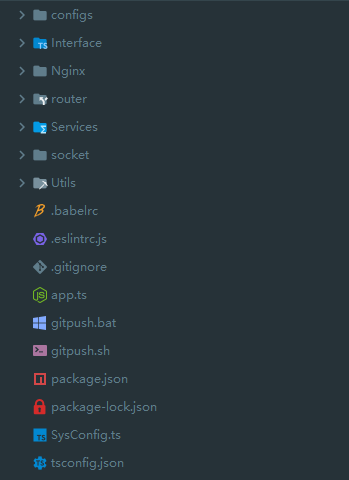

## 使用TypeScript重写接口服务

> 之前使用node写过一个接口服务，用起来还可以，最近突然对TypeScript感兴趣，于是又开始了折腾。。。

### 一、目录结构



> 由于刚开始学TypeScript，工作又处于缓慢状态，并没有进行深度改造，完全是个半成品。。。
>
> any大法好~~~

```typescript
/*
 * @Author: 柯军
 * @Date: 2019-08-20 17:43:46
 * @Description: 待做记事本实现
 */
import BaseSvc from "../Utils/BaseSvc";

export default class ToDoListSvc extends BaseSvc {

  constructor(props?:any) {
    super(props);
  }

  /**
   * @createtime 2019/08/20 18:35:11
   * @author 柯军 <arthaskj@163.com>
   * @param {string} user 获取用户识别标记
   * @desc 根据用户获取所有待做项
   */
  GetTodoList(params:any) {
    let { user } = params;

    let SQL = `SELECT * 
                  FROM ToDoList 
                  WHERE CreateUser = '${user}' 
                  ORDER BY ToDoState ASC,ID DESC`;

    return this._Context.DataBase.PROJ(SQL);
  }

  /**
   * @createtime 2019/08/20 18:53:05
   * @author 柯军 <arthaskj@163.com>
   * @param {array} todos 可以批量添加{text:内容,user:用户,time:时间}
   * @desc 保存待办事项
   */
  SaveTodoList(params:any) {
    let { todosStr } = params;
    let todos = JSON.parse(todosStr),
      arr:Array<string> = [];

    todos.forEach(function(x:any) {
      let { text, user, time } = x;
      arr.push(`('${text}','0','0','${user}','${time}')`);
    });
    let SQL = `INSERT 
                INTO ToDoList(ToDoText,ToDoState,EndTime,CreateUser,CreateTime) 
                VALUES${arr.join(',')}`;

    return this._Context.DataBase.PROJ(SQL);
  }

  /**
   * @createtime 2019/08/20 18:55:32
   * @author 柯军 <arthaskj@163.com>
   * @param {array} todos 可以批量添加{id:待办事项识别ID}
   * @desc 批量设置待做状态
   */
  SetTodosStatus(params:any) {
    let { todosStr } = params;
    let todos = JSON.parse(todosStr),
      arr:Array<string> = [];

    todos.forEach(function(id:any) {
      arr.push(` ID = '${id}' `);
    });
    let SQL = `UPDATE ToDoList 
                SET ToDoState='1' 
                WHERE ${arr.join(' OR ')};`;

    return this._Context.DataBase.PROJ(SQL);
  }

  /**
   * @createtime 2019/08/20 18:55:32
   * @author 柯军 <arthaskj@163.com>
   * @param {number} state 状态 {0:关闭,1:打开}
   * @param {number} id 待办事项识别ID
   * @desc 单个设置待做状态
   */
  SetTodoStatus(params:any) {
    let { state, id } = params;

    let SQL = `UPDATE ToDoList 
                SET ToDoState='${state}' 
                WHERE ID = ${id};`;

    return this._Context.DataBase.PROJ(SQL);
  }

  /**
   * @createtime 2019/08/20 19:00:33
   * @author 柯军 <arthaskj@163.com>
   * @param {number} id 待办事项识别ID
   * @desc 删除待办事项
   */
  DeleteTodo(params:any) {
    let { id } = params;

    let SQL = `DELETE 
                FROM ToDoList 
                WHERE ID = '${id}'`;

    return this._Context.DataBase.PROJ(SQL);
  }

};
```