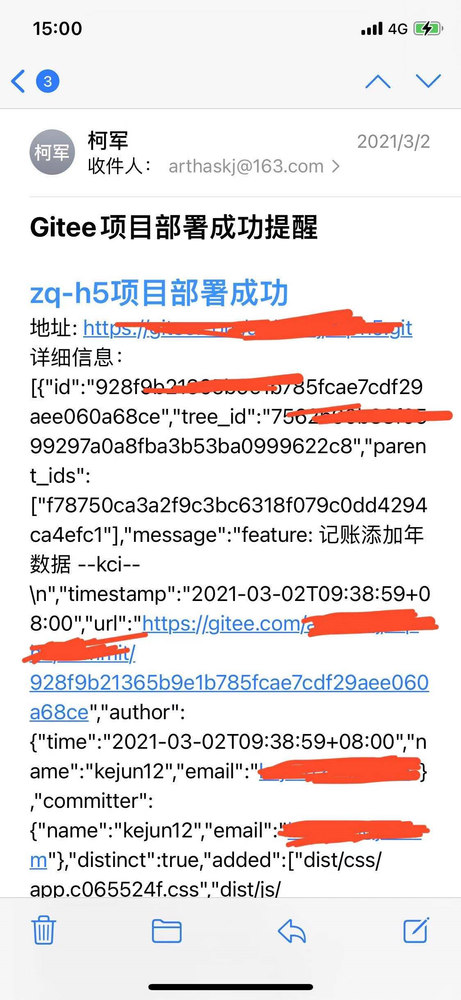
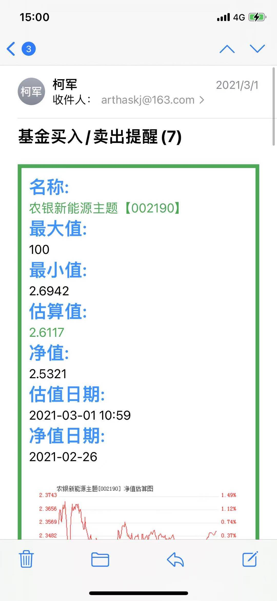

## Node实现邮件发送

### 一、配置文件

> 这里需要注意的就是邮箱需要开启POP3服务，否则无法发送邮件，开通POP3服务时需要记录下你的授权码，发送邮件需要你的授权码，而不是你的邮箱密码！！！切记！！！

```js
 // email发送方配置
  email: {
    service: 'QQ',
    user: '***@qq.com',
    password: '***', // 授权码，不是邮箱密码
  },
```

### 二、实现邮件发送方法

```js
/*
 * @Author: 柯军
 * @Date: 2019-01-30 15:28:50
 * @Description:
 */
const nodemailer = require('nodemailer');
let smtpTransport = require('nodemailer-smtp-transport');
const SysConfig = require('../../sysConfig');

const config = {
  email: SysConfig.email,
};

smtpTransport = nodemailer.createTransport(smtpTransport({
  service: config.email.service,
  auth: {
    user: config.email.user,
    pass: config.email.password,
  },
}));

/**
 * @param {string[]} recipient 收件人
 * @param {String} subject 发送的主题
 * @param {String} html 发送的html内容
 */
// eslint-disable-next-line max-params
const sendMail = function(recipient, subject, html, opt) {
  return new Promise((success, error) => {
    smtpTransport.sendMail({
      from: config.email.user,
      to: recipient,
      subject,
      html,
      ...opt,
    }, function(err) {
      if (err) {
        error(err);
        return;
      }
      success(true);
    });
  });
};
// Utils.sendMail(["arthaskj@163.com","kj18326661192@hotmail.com"],"收款码","这是测试邮件");
// const {address, subject, html} = {
//   address: ['arthaskj@163.com'],
//   subject: "K记",
// eslint-disable-next-line max-len
//   html: "【K记】您的验证码是<h1 style='margin:0 10px;display:inline-block;color:#1f90e6'>11111</h1>，用于密码更改，1分钟内有效。验证码提供给他人可能导致账号被盗，请勿泄露，谨防被骗。",
// }
// const result = await sendEmail(address, subject, html)
// if(result === true) {
//   return data;
// }
// return result;
module.exports = sendMail;

```

### 三、使用

```js
sendMail([ 'arthaskj@163.com' ], 'EggJs异常提醒', '这是邮件啊！！！');
```



