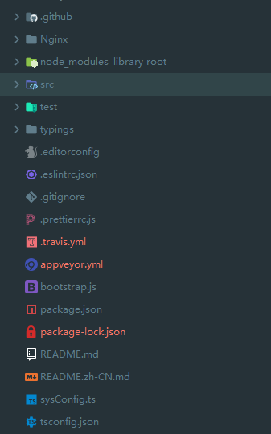
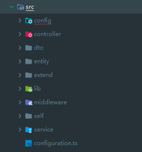

## Midway实现接口服务

> 使用过Egg之后感觉跟java之类的语言还是有差异，其中最麻烦的是一个新的接口要给他配路由，然后还的区分Get，Post。这让我想起了TS的注解，于是百度了一下发现还真有Egg的typescript升级版本`MidWay`.
>
> So......继续折腾


### 一、目录结构





### 二、配置文件

```js
import { EggAppConfig, EggAppInfo, PowerPartial } from 'egg';
import * as typegoose from '@midwayjs/typegoose';
import cConfig from '../../sysConfig';

export type DefaultConfig = PowerPartial<EggAppConfig>;

// mongoDB连接配置
export const mongoose: typegoose.DefaultConfig = {
  uri: 'mongodb://***:***@***/db_dev',
  options: {
    useNewUrlParser: true,
    useUnifiedTopology: true,
    dbName: 'db_dev',
    user: '***',
    pass: '***'
  }
}

export default (appInfo: EggAppInfo) => {
  const config = {} as DefaultConfig;

  // use for cookie sign key, should change to your own and keep security
  config.keys = appInfo.name + '***';

  config.security = {
    csrf: {
      enable: false,
    },
  };

  // add your config here
  config.middleware = [
    'paramsFormatMiddleware',
    'errorHandlerMiddleware',
  ];

  config.midwayFeature = {
    // true 代表使用 midway logger
    // false 或者为空代表使用 egg-logger
    replaceEggLogger: true
  }

  config.errorHandler = {
    // 通用配置（以下是重点）
    enable: true, // 控制中间件是否开启。
  };

    // jwt验证配置
  config.jwt = {
    enable: true,
    secret: '***',
  };

    // 微信相关配置
  config.wechat = {
    token: cConfig.wechat.token,
    appid: cConfig.wechat.appId,
    encodingAESKey: cConfig.wechat.encodingAESKey,
  };

  config.mongoose = mongoose;

  return config;
};

```

### 三、Controller

> 现在，你就可以使用Typescript强大的注解来处理之前在egg里需要大段复杂且繁琐代码才能处理的事情。目前统一的返回体处理还未完成~~~

```js
import {Inject, Controller, Provide, Query, Get, Post, Body, ALL, Validate} from '@midwayjs/decorator';
import { Context } from 'egg';
import { FundService } from '../service/fund';
import { FundDTO, FundItemDTO } from '../dto/IFund';

@Provide()
@Controller('/api/fund')
export class FundController {
  @Inject()
  ctx: Context;

  @Inject()
  fundService: FundService;

  @Post('/add')
  @Validate()
  async Add(@Body(ALL) fund: FundDTO) {
    const result = await this.fundService.Add(this.ctx.KParams);
    return { success: true, message: 'OK', data: result };
  }

  @Post('/addFundItem')
  async AddFundItem(@Body(ALL) fundItem: FundItemDTO) {
    const result = await this.fundService.AddFundItem(this.ctx.KParams);
    return { success: true, message: 'OK', data: result };
  }

  @Get('/getAll')
  async GetAll(@Query() uid) {
    const result = await this.fundService.GetAll(this.ctx.KParams);
    return { success: true, message: 'OK', data: result };
  }

  @Get('/getFundList')
  async GetFundList(@Query() uid) {
    const result = await this.fundService.GetFundList(this.ctx.KParams);
    return { success: true, message: 'OK', data: result };
  }

  @Get('/deleteById')
  async DeleteById(@Query() _id) {
    const user = await this.fundService.DeleteById(this.ctx.KParams);
    return { success: true, message: 'OK', data: user };
  }

  @Post('/update')
  async Update(@Body(ALL) fund: FundDTO) {
    const result = await this.fundService.Update(this.ctx.KParams);
    return { success: true, message: 'OK', data: result };
  }

  @Post('/updateFundItem')
  async UpdateFundItem(@Body(ALL) fundItem: FundItemDTO) {
    const result = await this.fundService.UpdateFundItem(this.ctx.KParams);
    return { success: true, message: 'OK', data: result };
  }

  @Get('/GetMarketInfo')
  async GetMarketInfo() {
    const result = await this.fundService.GetMarketInfo();
    return { success: true, message: 'OK', data: result };
  }
}

```

### 四、Service

```js
import {Init, Inject, Provide} from '@midwayjs/decorator';
import { getModelForClass } from '@typegoose/typegoose';
import { FundInfo, FundItemInfo } from '../entity/fund';
import { FundDTO, FundItemDTO } from '../dto/IFund';
import { Context } from 'egg';
import request from 'request';
import helper from "../extend/helper";

@Provide()
export class FundService {

  fundInfoModel;

  fundItemInfoModel;

  @Inject()
  ctx: Context;

  @Init()
  async init() {
    // get model
    this.fundInfoModel = getModelForClass(FundInfo, {
      schemaOptions: {collection: 'fund_info'}
    });

    this.fundItemInfoModel = getModelForClass(FundItemInfo, {
      schemaOptions: {collection: 'fund_list'}
    });

  }

  /**
   * 添加基金信息
   * @createTime 2021-03-05 11:04:28
   */
  async Add(params?: FundDTO) {
    if (params) {
      const { code } = params;
      const result = await this.fundInfoModel.findOne({ code });
      if (result) {
        this.ctx.throw(500, '已存在相同基金！');
      }
      params.createTime = helper.dateFormat(new Date(), 'YYYY/mm/dd HH:MM:SS');
      return await this.fundInfoModel.create(params);
    }
    this.ctx.throw(500, '请输入参数！');
  }
  /**
   * 添加当日基金收益
   * @createTime 2021-03-05 11:04:50
   */
  async AddFundItem(params?: FundItemDTO) {
    if (params) {
      const { code, incomeDate } = params;
      const result = await this.fundItemInfoModel.findOne({ code, incomeDate });
      params.createTime = helper.dateFormat(new Date(), 'YYYY/mm/dd HH:MM:SS');
      if (result) {
        return await this.UpdateFundItem(params);
      }
      return await this.fundItemInfoModel.create(params);
    }
    this.ctx.throw(500, '请输入参数！');
  }

  /**
   * 获取所有基金代码
   * @createTime 2021-03-05 11:05:17
   */
  async GetAll(params?: FundDTO) {
    const { userId } = params;
    return await this.fundInfoModel.find({ userId });
  }

  /**
   * 获取所有基金收入数据
   * @createTime 2021-03-05 11:05:31
   */
  async GetFundList(params?: FundItemDTO) {
    const { userId } = params;
    return await this.fundItemInfoModel.find({ userId });
  }

  /**
   * 删除基金
   * @createTime 2021-03-05 11:05:50
   */
  async DeleteById(params?: FundDTO) {
    const { _id } = params;
    if (_id) {
      return await this.fundInfoModel.deleteOne({ _id });
    }
    this.ctx.throw(500, '缺少ID！');
  }

  /**
   * 更新基金数据
   * @createTime 2021-03-05 11:06:01
   */
  async Update(params?: FundDTO) {
    const { _id } = params;
    if (_id) {
      return await this.fundInfoModel.updateOne({ _id }, params);
    }
    this.ctx.throw(500, '缺少ID！');
  }

  /**
   * 更新基金收益情况
   * @createTime 2021-03-05 11:06:17
   */
  async UpdateFundItem(params?: FundItemDTO) {
    const { code, incomeDate } = params;
    if (code) {
      return await this.fundItemInfoModel.updateOne({ code, incomeDate }, params);
    }
    this.ctx.throw(500, '缺少Code！');
  }

  /**
   * 更新基金名称，给调度任务使用
   * @createTime 2021-03-05 11:06:31
   */
  async UpdateFundName(params?: FundDTO) {
    const { code } = params;
    if (code) {
      return await this.fundInfoModel.updateOne({ code }, params);
    }
    this.ctx.throw(500, '缺少Code！');
  }

  /**
   * 调用接口获取基金详细信息
   * @createTime 2021-03-05 11:06:48
   */
  async GetFundInfo(params?: FundDTO) {
    const { code } = params;
    return new Promise((resolve, reject) => {
      request.get(`***/${code}.js`, async (err, res, body) => { // 发送请求
        if (err) {
          reject(err);
          this.ctx.throw(500, err);
        }
        try {
          const data = JSON.parse(body.replace('jsonpgz({"', '{"').replace('"});', '"}'));
          resolve(data);
        } catch (e) {
          reject(e);
          this.ctx.throw(500, e);
        }
      });
    });
  }

  /**
   * 获取当前大盘行情
   * @createTime 2021-03-05 11:07:05
   */
  async GetMarketInfo(params?: FundDTO) {
    const url = '***';
    const fn = () => {
      return new Promise((resolve, reject) => {
        request.get(url, async (err, res, body) => { // 发送请求
          if (err) {
            reject(err);
            this.ctx.throw(500, err);
          }
          try {
            resolve((JSON.parse(body) || {}).data.diff);
          } catch (e) {
            reject(e);
            this.ctx.throw(500, e);
          }
        });
      });
    };

    return await fn();
  }

}

```

### 五、DTO、Entity

> 创建DTO文件可以在mongodb操作时进行校验，很是方便。它可以设置字段的类型，是否必填，以及最大最小值等等条件，但传入的参数不符合条件时会在编辑器里自动进行提醒，接口请求时字段不规范也会抛出异常。

```js
import { Rule, RuleType } from "@midwayjs/decorator";

export class FundDTO {
  @Rule(RuleType.string())
  _id: string;

  @Rule(RuleType.string().required())
  code: string;

  @Rule(RuleType.string())
  name: string;

  @Rule(RuleType.boolean())
  star: boolean;

  @Rule(RuleType.string())
  userId: string;

  @Rule(RuleType.number().min(0))
  min: number;

  @Rule(RuleType.number().min(0))
  max: number;

  @Rule(RuleType.string())
  createTime: string;
}

export class FundItemDTO {
  @Rule(RuleType.string())
  _id: string;

  @Rule(RuleType.string().required())
  code: string;

  @Rule(RuleType.string())
  name: string;

  @Rule(RuleType.number().required())
  income: number;

  @Rule(RuleType.string())
  incomeDate: string;

  @Rule(RuleType.string())
  userId: string;

  @Rule(RuleType.string())
  createTime: string;
}

```

```js
import { prop } from '@typegoose/typegoose';

export class FundInfo {
  @prop()
  public name?: string;

  @prop()
  public code: string;

  @prop()
  public star?: boolean;

  @prop()
  public userId?: string;

  @prop()
  public min?: number;

  @prop()
  public max?: number;

  @prop()
  public createTime?: string;

  // @prop({ type: () => [String] })
  // public jobs?: string[];
}

export class FundItemInfo {
  @prop()
  public name?: string;

  @prop()
  public code: string;

  @prop()
  public income: number;

  @prop()
  public incomeDate: string;

  @prop()
  public userId: string;

  @prop()
  public createTime?: string;

  // @prop({ type: () => [String] })
  // public jobs?: string[];
}

```

